# CK+ Facial Expression Benchmark

Comparative benchmark of pretrained CNN architectures for facial expression
recognition using the CK+ dataset, transfer learning, and fine-tuning.

The objective of this project is not to determine a universally "best"
architecture, but to experimentally compare different CNN architectures
by optimizing their training configurations individually and analyzing the
trade-off between predictive performance and computational requirements.

---

# Research Question

How do pretrained CNN architectures compare in terms of facial expression
recognition performance and computational efficiency on the CK+ dataset?

---

# Features

- Transfer learning with pretrained CNN architectures
- Architecture-specific hyperparameter optimization
- Fine-tuning of pretrained models
- Macro Precision, Macro Recall and Macro F1 evaluation
- Confusion matrices
- Per-class F1 analysis
- Model parameter comparison
- GFLOPs comparison
- Model size comparison
- Training time comparison
- Training and validation learning curves
- Reproducible training configurations

---

# Technologies

## Deep Learning

- Python (`3.12.3`)

- PyTorch (`torch==2.14.0`)

- Torchvision (`torchvision==0.29.0`)

- CUDA (`13.0`)

## Data Science

- NumPy (`numpy==2.5.3`)

- Pandas (`pandas==3.0.6`)

- Scikit-learn (`scikit-learn==1.9.1`)

## Visualization

- Matplotlib (`matplotlib==3.11.2`)

- Seaborn (`seaborn==0.13.2`)

- adjustText (`adjustText==1.4.0`)

## Model Analysis

- THOP (`thop==0.1.1.post2209072238`)

## Utilities

- Pillow (`Pillow==12.3.0`)

## API

- FastAPI (`fastapi==0.141.1`)

- Uvicorn (`uvicorn==0.53.0`)

- python-multipart (`python-multipart==0.0.32`)

---

# Dataset

The benchmark uses the CK+ (Cohn-Kanade Extended) dataset distributed
through HyperAI.

Dataset:

[https://hyper.ai/en/datasets/16471](https://hyper.ai/en/datasets/16471)

The dataset contains facial image sequences together with emotion labels
and facial landmark coordinates.

The original dataset structure includes:

- `cohn-kanade-images`: facial image sequences
- `Emotion`: emotion labels for validated sequences
- `Landmarks`: facial landmark coordinates

The dataset was first processed to separate the facial images and landmark
coordinates into class-based directories.

For each validated sequence:

- The first frame was assigned to the `Neutral` class (`0`).
- The last frame, corresponding to the peak expression, was assigned to its
  corresponding emotion class.
- The emotion label was obtained from the corresponding file in the
  `Emotion` directory.
- The facial landmark coordinates were kept separately to perform
  landmark-based face cropping.

The emotion classes used in the benchmark are:

- `0`: Neutral
- `1`: Anger
- `2`: Contempt
- `3`: Disgust
- `4`: Fear
- `5`: Happiness
- `6`: Sadness
- `7`: Surprise

The image `S129_002_00000011.png` and its corresponding landmark file
`S129_002_00000011_landmarks.txt` were excluded from the benchmark because
the associated emotion annotation was identified as incorrect.

## Image Preprocessing

The facial images were converted to grayscale and replicated across three
channels to maintain compatibility with ImageNet-pretrained CNN
architectures.

Facial landmarks were used to determine a bounding box around the face.
A 20% margin was added around the landmark-based bounding box, after which
the region was converted into a square crop while keeping the crop within
the image boundaries.

The resulting facial crops were resized according to the recommended input
resolution of each architecture:

- MobileNet V2: `224 × 224`
- MobileNet V3 Small: `224 × 224`
- MobileNet V3 Large: `224 × 224`
- ResNet18: `224 × 224`
- ResNet34: `224 × 224`
- ResNet50: `224 × 224`
- ResNet101: `224 × 224`
- EfficientNet-B0: `224 × 224`
- EfficientNet-B1: `240 × 240`
- EfficientNet-B2: `288 × 288`
- EfficientNet-B3: `300 × 300`
- EfficientNet-B4: `380 × 380`

The original image files and landmark coordinates were preserved separately
from the transformed images used by the models.

---

# CNN Architectures

The benchmark evaluates the following pretrained architectures:

## ResNet

- ResNet18

- ResNet34

- ResNet50

- ResNet101

## MobileNet

- MobileNetV2

- MobileNetV3 Small

- MobileNetV3 Large

## EfficientNet

- EfficientNet-B0

- EfficientNet-B1

- EfficientNet-B2

- EfficientNet-B3

- EfficientNet-B4

All models use ImageNet-pretrained weights and are evaluated using a common
experimental methodology, with architecture-specific hyperparameter
optimization.

---

# Experimental Methodology

The experiments begin with a common baseline configuration across
architectures. Hyperparameters are then optimized individually for each
architecture to obtain an appropriate training configuration while using
validation performance for model selection.

The following random seeds and CUDA settings were used during training to
improve reproducibility:

- Python: `random.seed(42)`

- NumPy: `np.random.seed(42)`

- PyTorch CPU: `torch.manual_seed(42)`

- PyTorch CUDA: `torch.cuda.manual_seed_all(42)`

- cuDNN deterministic mode: `True`

- cuDNN benchmark mode: `False`

---

## Data Split

The dataset was divided into training, validation, and testing sets using
a subject-wise split to prevent images from the same subject from appearing
in different subsets.

The approximate distribution is:

- 80% training

- 10% validation

- 10% testing

---

## Class Imbalance Handling

The training set exhibits class imbalance across the eight emotion classes.
To mitigate its effect during training, a `WeightedRandomSampler` is used
to increase the sampling frequency of underrepresented classes.

Class weights are computed using the inverse square root of the class
frequency:

`1 / sqrt(count)`

Sampling is performed with replacement, using the same number of samples
as the original training set.

The `WeightedRandomSampler` is applied only to the training set. Validation
and test sets use the natural class distribution and are evaluated without
sampling to preserve the original distribution of the respective subsets.

---

## Image Preprocessing

Training images are augmented using the following transformations:

- **Random rotation**: ±10°, with a fill value of `[128, 128, 128]`
  to match the grayscale image background after channel replication

- **Horizontal flip**: p=0.5, since facial expressions can generally be
  represented under horizontal reflection

- **ImageNet normalization**: mean `[0.485, 0.456, 0.406]` and standard
  deviation `[0.229, 0.224, 0.225]`, matching the normalization used for
  the ImageNet-pretrained backbones

No color augmentation is applied because the input images are converted to
grayscale before being replicated across three channels. No vertical flip
is used because vertical reflection would produce anatomically unrealistic
facial configurations.

The same augmentation strategy is applied across all architectures to
maintain consistency during training.

The first grid below shows six randomly augmented versions of the same
training image, illustrating how the training augmentation pipeline can
produce different variations of a facial image:

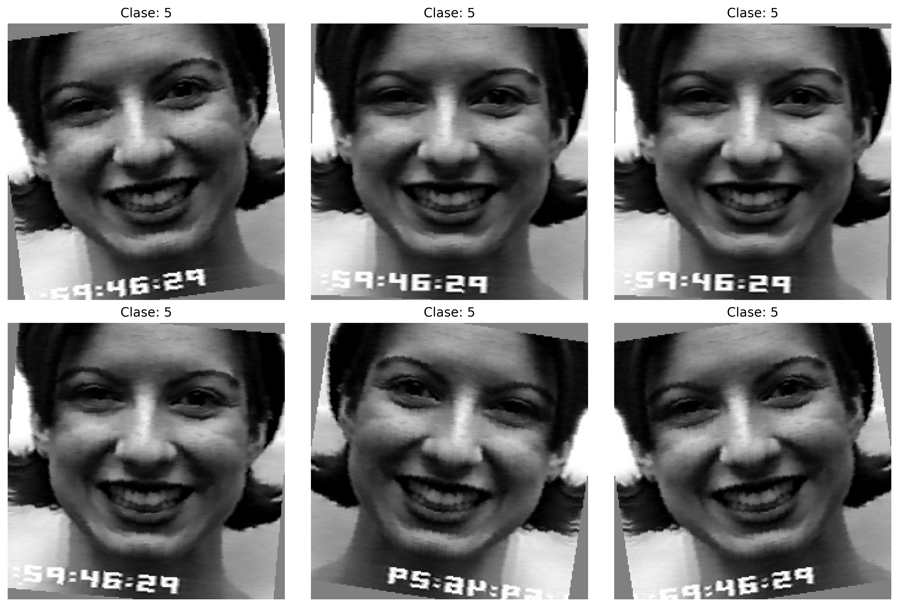

The second grid shows one randomly augmented sample from each of the eight
emotion classes, illustrating how the same augmentation pipeline is applied
across different facial expressions:

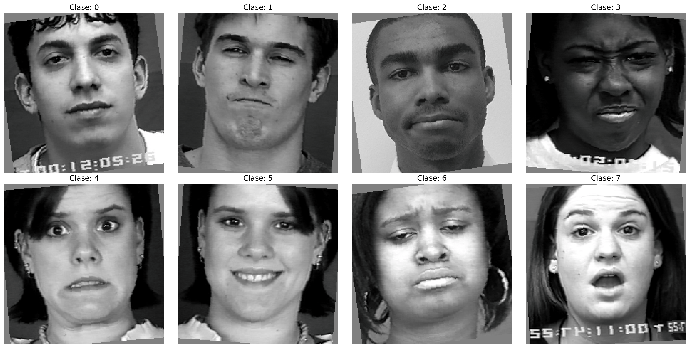

Validation and test images are not augmented. They are converted to tensors
and normalized using the same ImageNet statistics, after being resized to
the input resolution required by each architecture during preprocessing.

---

## Training Strategy

Training is performed in two phases.

### Phase 1 — Classifier Training

The pretrained backbone is frozen and only the classifier is trained. The
same configuration is used for all architectures.

- Optimizer: AdamW
- Classifier learning rate: `3e-4`
- Weight decay: `1e-4`
- Scheduler: CosineAnnealingLR
- `T_max`: `5`
- Minimum learning rate: `1e-6`
- Duration: 5 epochs

### Phase 2 — Fine-Tuning

The complete network is unfrozen and fine-tuned using architecture-specific
hyperparameter configurations. These configurations were selected through
individual hyperparameter optimization using validation Macro F1 for model
selection.

| **Model** | **Weight Decay** | **Backbone LR** | **Classifier LR** | **T_max** |
| --------- | ----------------: | --------------: | ----------------: | --------: |
| ResNet18 | `1e-4` | `3e-5` | `3e-4` | `25` |
| ResNet34 | `1e-4` | `3e-5` | `3e-4` | `25` |
| ResNet50 | `1e-4` | `3e-5` | `3e-4` | `25` |
| ResNet101 | `1e-4` | `3e-5` | `3e-4` | `25` |
| MobileNetV2 | `1e-4` | `3e-5` | `3e-4` | `25` |
| MobileNetV3 Large | `1e-4` | `3e-5` | `3e-4` | `25` |
| MobileNetV3 Small | `1e-4` | `3e-5` | `3e-4` | `25` |
| EfficientNet-B0 | `1e-4` | `3e-5` | `1e-4` | `35` |
| EfficientNet-B1 | `1e-4` | `3e-5` | `3e-4` | `25` |
| EfficientNet-B2 | `1e-4` | `5e-5` | `3e-4` | `35` |
| EfficientNet-B3 | `1e-4` | `1e-4` | `3e-4` | `35` |
| EfficientNet-B4 | `1e-4` | `1e-4` | `3e-4` | `35` |

For Phase 2, all configurations use the AdamW optimizer and
CosineAnnealingLR scheduler with a minimum learning rate (`eta_min`) of
`1e-6`. The backbone and classifier use separate initial learning rates
according to the configuration selected for each architecture.

---

## Training Configuration

- Loss: Cross Entropy with label smoothing (`0.1`)
- Maximum epochs: `200`
- Early stopping: `10` epochs without improvement
- Early stopping metric: Validation Macro F1
- Batch size: `32` for all architectures, except EfficientNet-B4, which uses
  a batch size of `16` due to GPU memory constraints
- Input resolution: Architecture-specific, according to the recommended
  input resolution of each pretrained architecture
- Checkpointing: Full training state saved every epoch, allowing training
  to be resumed after interruption

The training configuration was initialized from a common baseline and then
optimized individually for each architecture. Hyperparameter changes were
evaluated using Validation Macro F1.

---

# Evaluation Metrics

The models are evaluated using:

- Accuracy
- Macro Precision
- Macro Recall
- Macro F1
- Confusion Matrix
- Per-class F1

Macro F1 is used as the primary comparison metric, since it weights
all classes equally regardless of their sample count — relevant given
the class imbalance present in the dataset.

Computational characteristics are evaluated using:

- Number of parameters
- GFLOPs
- Model size
- Training time

---

# Results

## Test Results

The following table summarizes the test performance and computational
characteristics obtained for each evaluated architecture.

| Model | Accuracy | Macro Precision | Macro Recall | Macro F1 | Parameters (M) | GFLOPs | Model Size (MB) | Training Time (s) |
|---|---:|---:|---:|---:|---:|---:|---:|---:|
| ResNet18 | 92.31% | 92.98% | 86.08% | 85.80% | 11.18 | 1.824 | 42.73 | 67.56 |
| ResNet34 | 92.31% | 89.12% | 88.83% | 87.92% | 21.29 | 3.678 | 81.35 | 67.45 |
| ResNet50 | 90.77% | 90.28% | 83.25% | 82.72% | 23.52 | 4.132 | 90.05 | 113.38 |
| ResNet101 | 92.31% | 88.15% | 90.17% | 87.39% | 42.52 | 7.864 | 162.81 | 163.73 |
| MobileNetV2 | 81.54% | 68.60% | 65.17% | 63.71% | 2.23 | 0.326 | 8.77 | 72.37 |
| MobileNetV3 Small | 73.85% | 56.59% | 65.58% | 56.91% | 1.53 | 0.061 | 5.96 | 31.46 |
| MobileNetV3 Large | 93.85% | 89.50% | 86.08% | 86.04% | 4.21 | 0.234 | 16.28 | 79.06 |
| EfficientNet B0 | 90.77% | 79.47% | 78.04% | 78.69% | 4.02 | 0.414 | 15.63 | 102.81 |
| EfficientNet B1 | 84.62% | 74.65% | 64.50% | 65.76% | 6.52 | 0.609 | 25.32 | 158.94 |
| EfficientNet B2 | 93.85% | 91.97% | 87.12% | 86.82% | 7.71 | 0.701 | 29.87 | 227.67 |
| EfficientNet B3 | 90.77% | 89.55% | 79.83% | 81.23% | 10.71 | 1.018 | 41.40 | 177.92 |
| EfficientNet B4 | 92.31% | 91.21% | 88.83% | 87.45% | 17.56 | 1.577 | 67.75 | 413.84 |

## Training and Validation Results

The following table summarizes the training and validation metrics recorded
at the best validation Macro F1 epoch for each architecture.

| Model | Best Epoch | Train Loss | Train Accuracy | Train Macro Precision | Train Macro Recall | Train Macro F1 | Val Loss | Val Accuracy | Val Macro Precision | Val Macro Recall | Val Macro F1 |
|---|---:|---:|---:|---:|---:|---:|---:|---:|---:|---:|---:|
| ResNet18 | 24 | 0.5199 | 99.81% | 99.81% | 99.91% | 99.86% | 0.6829 | 95.59% | 96.82% | 89.17% | 91.93% |
| ResNet34 | 14 | 0.5278 | 98.65% | 98.01% | 98.16% | 98.08% | 0.6394 | 95.59% | 95.12% | 90.83% | 92.34% |
| ResNet50 | 19 | 0.5330 | 99.04% | 98.86% | 98.95% | 98.90% | 0.7262 | 91.18% | 87.71% | 83.10% | 83.62% |
| ResNet101 | 18 | 0.5247 | 98.46% | 98.73% | 98.12% | 98.42% | 0.6127 | 94.12% | 94.38% | 89.05% | 90.30% |
| MobileNetV2 | 22 | 0.7960 | 89.04% | 90.03% | 85.13% | 87.16% | 0.8528 | 86.76% | 80.90% | 74.38% | 74.96% |
| MobileNetV3 Small | 13 | 0.9476 | 85.77% | 88.62% | 80.35% | 81.49% | 1.2712 | 70.59% | 49.54% | 58.36% | 52.29% |
| MobileNetV3 Large | 31 | 0.5904 | 98.27% | 98.35% | 98.35% | 98.34% | 0.7685 | 91.18% | 85.04% | 84.50% | 84.67% |
| EfficientNet-B0 | 29 | 0.6491 | 96.73% | 96.76% | 95.55% | 96.12% | 0.7264 | 91.18% | 92.70% | 80.00% | 83.32% |
| EfficientNet-B1 | 32 | 0.7848 | 91.35% | 89.95% | 88.67% | 89.17% | 0.7503 | 94.12% | 92.64% | 90.45% | 90.00% |
| EfficientNet-B2 | 31 | 0.5284 | 99.23% | 99.12% | 99.12% | 99.12% | 0.6307 | 95.59% | 94.72% | 92.50% | 91.71% |
| EfficientNet-B3 | 14 | 0.5457 | 99.23% | 99.33% | 98.76% | 99.04% | 0.5903 | 97.06% | 99.29% | 93.33% | 95.74% |
| EfficientNet-B4 | 18 | 0.5834 | 97.69% | 97.52% | 97.08% | 97.28% | 0.6087 | 97.06% | 99.29% | 93.33% | 95.74% |

---

# Results Analysis

In response to the research question, the benchmark shows substantial
differences between the evaluated CNN architectures in both facial expression
recognition performance and computational requirements on the CK+ dataset.

EfficientNet-B3 and EfficientNet-B4 achieved the highest Validation Macro F1,
both reaching 95.74%. However, their test performance differed considerably:
EfficientNet-B4 achieved 87.45% Test Macro F1, while EfficientNet-B3 achieved
81.23%. Similar validation-to-test gaps were observed across several
architectures, particularly EfficientNet-B1, which achieved 90.00% Validation
Macro F1 but only 65.76% on test. Given the limited size of CK+ and the small
number of samples in some test classes, these single-split test results should
be interpreted with caution.

Increasing model depth or capacity did not produce a monotonic improvement in
predictive performance. ResNet architectures ranged from 82.72% to 87.92%
Test Macro F1, while EfficientNet models ranged from 65.76% to 87.45%.
MobileNetV3 Large achieved 86.04% Test Macro F1 with only 4.21M parameters
and 0.234 GFLOPs, demonstrating that comparatively lightweight architectures
can achieve competitive predictive performance with lower computational
requirements.

Computational characteristics also varied substantially. MobileNetV3 Small
had the lowest computational cost, with 1.53M parameters and 0.061 GFLOPs,
while ResNet101 had 42.52M parameters and 7.864 GFLOPs. EfficientNet-B4
required 17.56M parameters and 1.577 GFLOPs, but had the longest training time
at 413.84 seconds.

These results indicate that predictive performance and computational
efficiency should be considered jointly when comparing CNN architectures.
Architecture capacity alone does not guarantee improved generalization or a
more favorable performance-to-cost trade-off, highlighting the importance of
empirical evaluation on subject-wise splits of the CK+ dataset.

---

# Results Visualization

The following visualizations show the **test-set results** obtained by each
evaluated architecture. The figures are generated directly from the
benchmark results stored in the project's CSV files.

## Test Results — Macro F1 Comparison

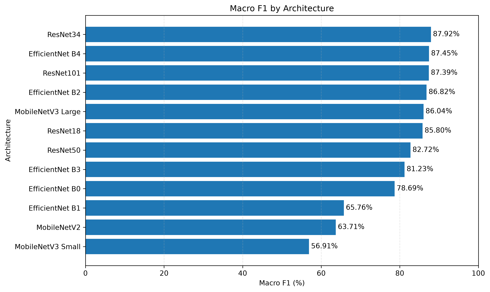

## Test Results — Macro F1 vs GFLOPs

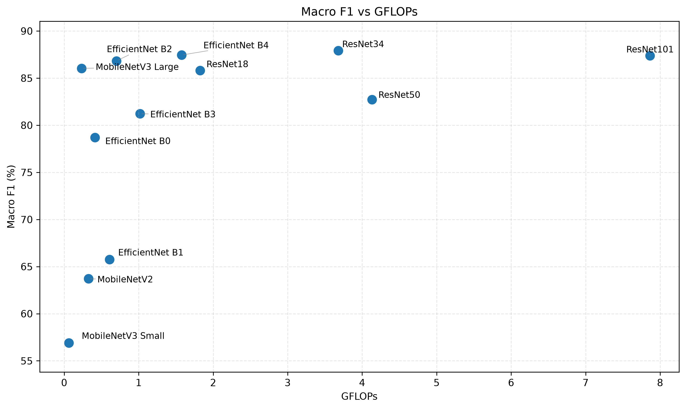

## Test Results — Accuracy vs Macro F1

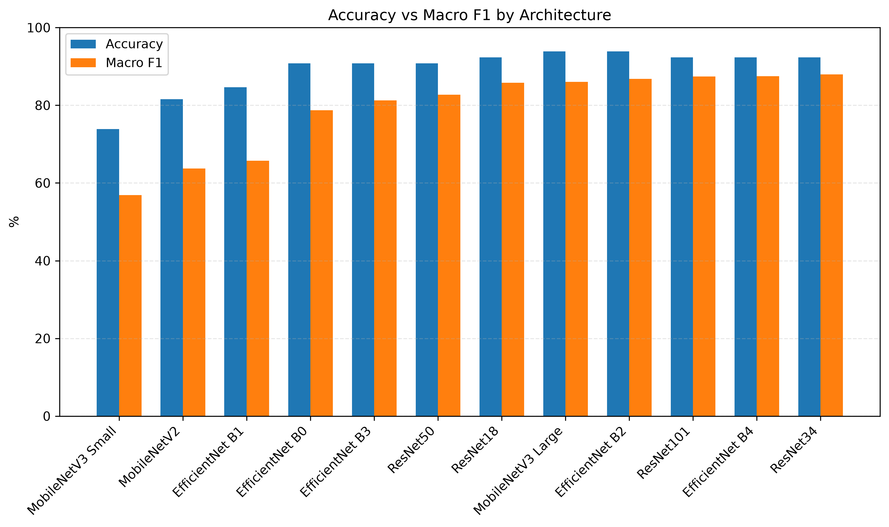

## Test Results — Macro Precision vs Macro Recall

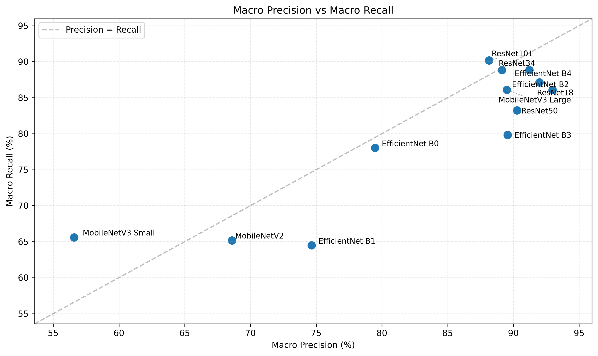

---

## Training and Validation

The following visualizations summarize the training and validation
results recorded at the best validation Macro F1 epoch for each
architecture.

### Epochs to Convergence

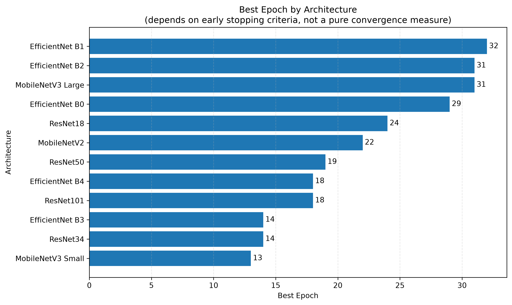

### Train-Validation Macro F1 Gap

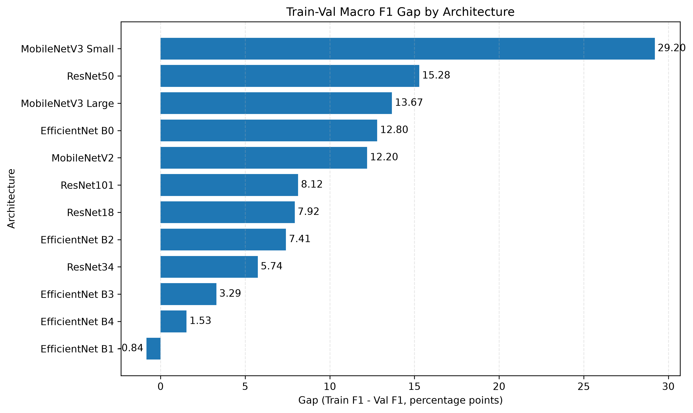

### Train vs Validation Macro F1

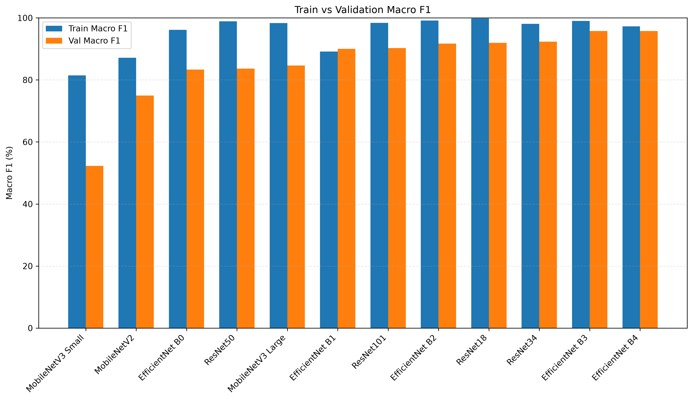

---

## Training Behavior Analysis

The number of epochs required to reach the best validation Macro F1 varied
across architectures, ranging from 13 epochs for MobileNetV3 Small to
32 epochs for EfficientNet-B1. This variation did not show a consistent
relationship with final test performance, indicating that reaching the best
validation performance earlier did not necessarily result in higher test
performance.

The train-validation Macro F1 gap also varied across architectures and did
not show a consistent relationship with either the number of epochs required
to reach the best validation Macro F1 or final test performance. These
differences highlight the variability of training behavior across
architectures and the importance of evaluating both validation performance
and final test results.

---

## Computational Efficiency

The benchmark evaluates model complexity using:

- Parameter count

- GFLOPs

- Model size

These measurements provide a hardware-independent reference for comparing
the computational characteristics of the evaluated architectures.

Training time is also reported as part of the benchmark results. Actual
inference latency, FPS and peak VRAM usage are not included because these
measurements depend strongly on the hardware, batch size and execution
environment.

---

## Qualitative Evaluation on Uncontrolled Images

To complement the quantitative evaluation on CK+, five additional images
were used to qualitatively examine the behavior of the trained models on
facial expressions captured in uncontrolled real-world conditions.

These images are not part of the CK+ dataset and were not used during
training, validation, or testing. Each image represents a different facial
expression and was evaluated using all benchmarked architectures.

The images were converted to grayscale and replicated across three channels
before inference, following the same input representation used during
training. **The original images were pixelated for visualization to reduce
the visibility of the subjects identities.** The same input image was passed
to every architecture within each case, allowing their predictions to be
compared under identical conditions.

### Case 1 — Happiness

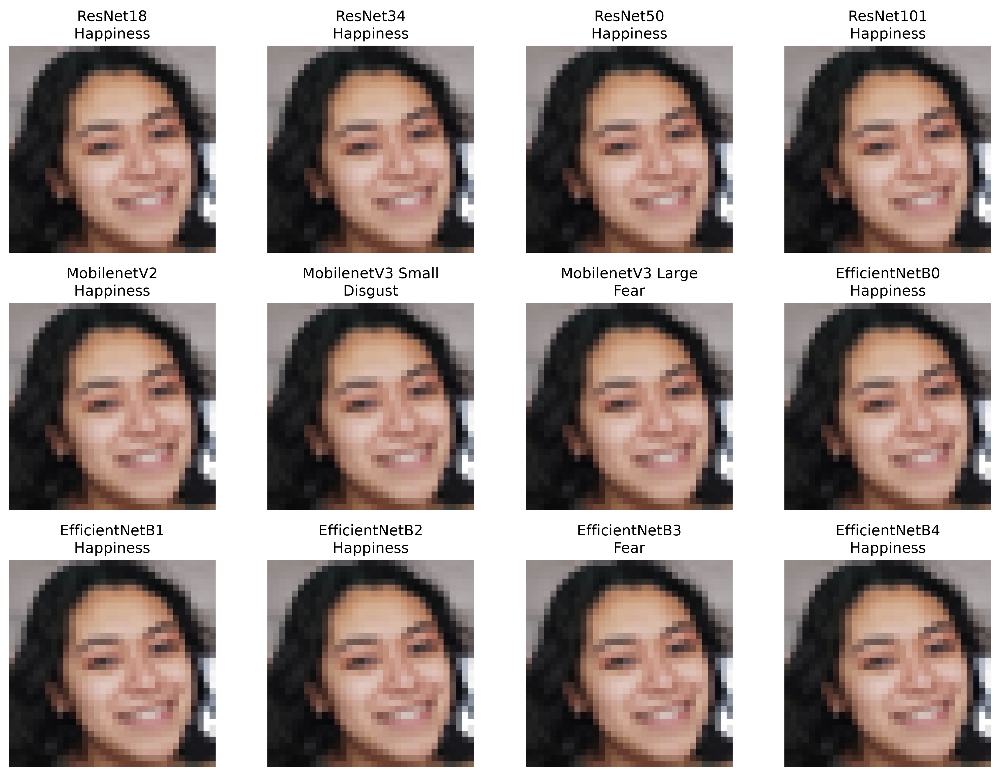

The models showed differences in their predictions despite receiving the
same image. The ResNet architectures consistently predicted "Happiness",
while MobileNetV3 Small and MobileNetV3 Large produced different emotion
predictions. Most EfficientNet variants predicted "Happiness", although
EfficientNet-B3 predicted "Fear".

This case illustrates that architectures with similar performance on the
CK+ benchmark can behave differently when presented with an image outside
the original dataset distribution. The prediction differences may be
associated with the visual characteristics of the image, including the
pixelation and the uncontrolled capture conditions.

### Case 2 — Neutral / Contempt

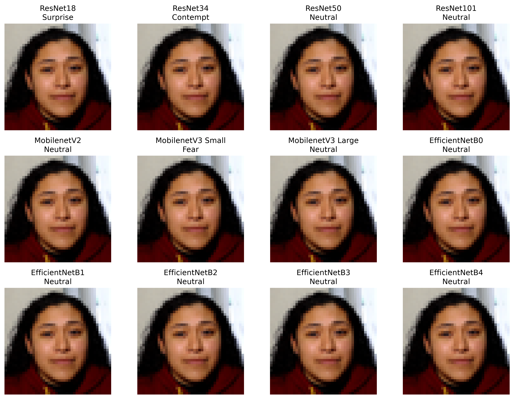

The predictions for this image show a noticeable difference between the
evaluated architectures. Nine of the twelve models predicted "Neutral",
while ResNet18 and ResNet34 predicted "Surprise" and "Contempt",
respectively, and MobileNetV3 Small predicted "Fear".

The expression in the image can be interpreted as relatively neutral,
although subtle facial characteristics may also lead to an interpretation
such as "Contempt". Therefore, the predictions should not be treated as a
definitive indication that one of these emotions is objectively correct.

The agreement among most architectures on "Neutral" provides an interesting
observation, while the different predictions from ResNet18, ResNet34, and
MobileNetV3 Small illustrate how models can produce different interpretations
when facial expressions are subtle and the input image is affected by
pixelation.

As with the other qualitative examples, this case is not used to measure
quantitative generalization performance. It is presented to illustrate
differences in model predictions under uncontrolled conditions.

### Case 3 — Happiness

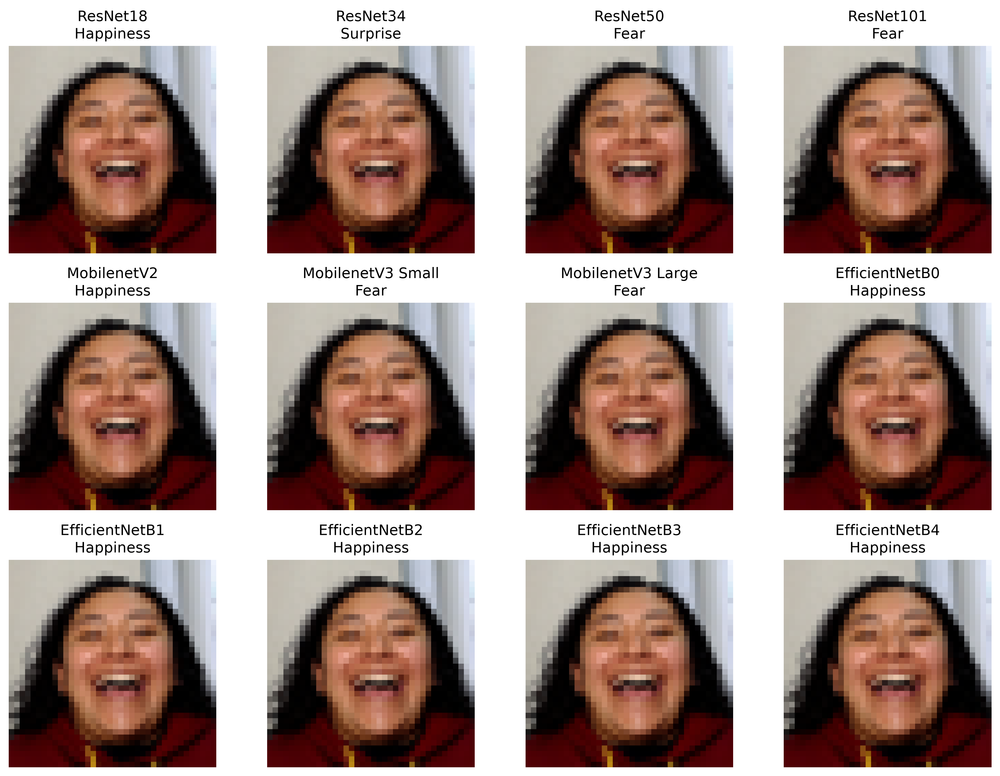

The predictions for this image show substantial differences between the
evaluated architectures despite all models receiving the same input. ResNet18
and MobileNetV2 correctly predicted "Happiness", while ResNet34 predicted
"Surprise" and ResNet50, ResNet101, MobileNetV3 Small, and MobileNetV3 Large
predicted "Fear".

In contrast, all EfficientNet variants from B0 to B4 predicted "Happiness".
This consistency is an interesting observation, particularly because the image
contains a pronounced open-mouth expression that may introduce visual
similarities with other emotions such as "Fear" or "Surprise".

The different predictions illustrate how architectures can interpret the same
facial expression differently when presented with an image outside the CK+
dataset. However, these results alone do not establish that a particular
architecture is more robust or that a specific visual feature caused the
incorrect predictions.

As with the other qualitative examples, this case is not intended as a
quantitative evaluation of generalization. It provides an additional
illustration of the differences in model behavior under uncontrolled
real-world conditions.

### Case 4 — Surprise

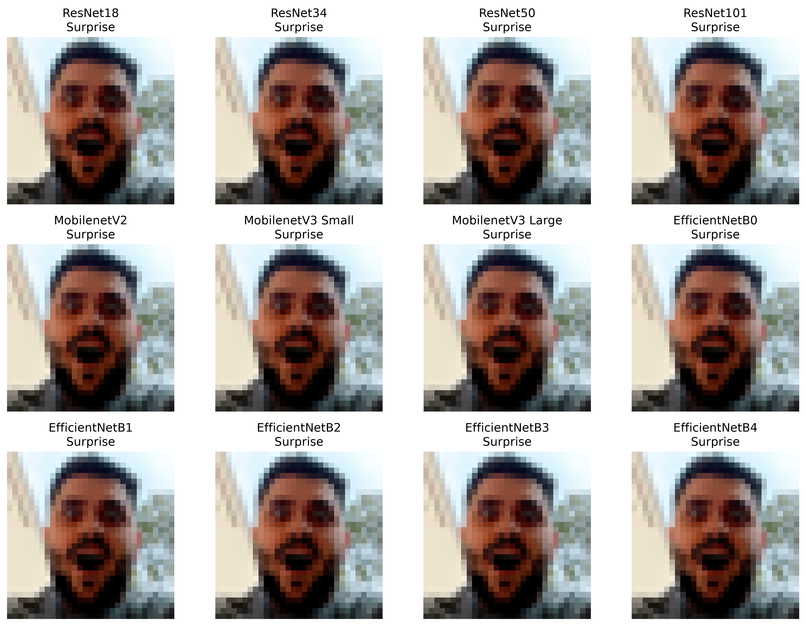

All twelve evaluated architectures predicted "Surprise" for this image. The
agreement includes both lightweight architectures, such as MobileNetV3 Small,
and larger models, such as ResNet101.

Unlike the more ambiguous expressions observed in previous cases, this image
presents a pronounced facial expression with several visual characteristics
associated with "Surprise". The strong expression may help explain the
consistent predictions across architectures.

This case provides an example in which the different architectures produced
the same prediction when presented with the same external image. However,
this single example cannot be used to establish that the models have learned
the same facial features or that the observed agreement would generalize to
other images.

As with the other qualitative examples, this case is not intended as a
quantitative evaluation of generalization. It illustrates how model
predictions may converge when the expression presents more clearly defined
visual characteristics.

### Case 5 — Neutral / Contempt

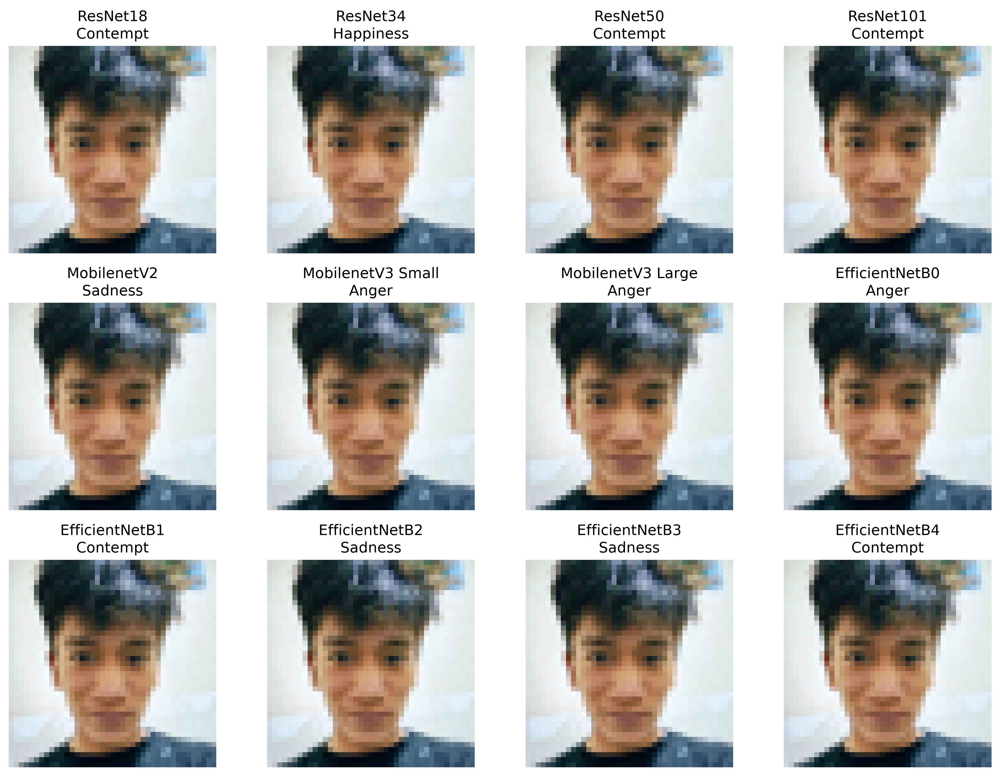

This image produced one of the largest variations in predictions across the
evaluated architectures. ResNet18, ResNet50, ResNet101, EfficientNet-B1, and
EfficientNet-B4 predicted "Contempt", while ResNet34 predicted "Happiness".

MobileNetV2, EfficientNet-B2, and EfficientNet-B3 predicted "Sadness", whereas
MobileNetV3 Small, MobileNetV3 Large, and EfficientNet-B0 predicted "Anger".

The distribution of predictions illustrates how differently the architectures
can interpret a subtle and asymmetric facial expression under uncontrolled
conditions.

The image can be interpreted as relatively neutral, but the asymmetric
position of the mouth may also resemble characteristics associated with
"Contempt". Therefore, the predictions should not be treated as evidence that
one specific emotion is objectively correct for this image.

The large number of different predictions is particularly interesting given
that "Contempt" is the least represented emotion in the CK+ benchmark. This
class contains substantially fewer samples than the other emotion classes,
which can make its generalization more challenging. However, the predictions
from this single external image cannot be used to establish that class
imbalance was the direct cause of the observed errors.

This case further illustrates the importance of evaluating Macro F1 and
per-class performance instead of relying exclusively on overall Accuracy,
particularly when working with imbalanced facial expression datasets.

As with the other qualitative examples, this image was not used during
training, validation, or testing and is presented only as a qualitative
example of model behavior under uncontrolled conditions.

# Project Structure

```text
ckplus-facial-expression-benchmark/
│
├── api/
│   ├── main.py
│   └── routers/
│       ├── efficientnet_b0.py
│       ├── efficientnet_b1.py
│       ├── efficientnet_b2.py
│       ├── efficientnet_b3.py
│       ├── efficientnet_b4.py
│       ├── mobilenet_v2.py
│       ├── mobilenet_v3_small.py
│       ├── mobilenet_v3_large.py
│       ├── resnet18.py
│       ├── resnet34.py
│       ├── resnet50.py
│       └── resnet101.py
│
├── dataset/
│   ├── dataset_preparation.ipynb
│   └── dataset_transformation.ipynb
│
├── model/
│   ├── resnet18/
│   ├── resnet34/
│   ├── resnet50/
│   ├── resnet101/
│   ├── mobilenet_v2/
│   ├── mobilenet_v3_small/
│   ├── mobilenet_v3_large/
│   ├── efficientnet_b0/
│   ├── efficientnet_b1/
│   ├── efficientnet_b2/
│   ├── efficientnet_b3/
│   └── efficientnet_b4/
│
├── training/
│   ├── resnet18/
│   ├── resnet34/
│   ├── resnet50/
│   ├── resnet101/
│   ├── mobilenet_v2/
│   ├── mobilenet_v3_small/
│   ├── mobilenet_v3_large/
│   ├── efficientnet_b0/
│   ├── efficientnet_b1/
│   ├── efficientnet_b2/
│   ├── efficientnet_b3/
│   └── efficientnet_b4/
│
├── results/
│   ├── analysis_results.ipynb
│   ├── analysis_test_external_test.ipynb
│   ├── inference_models.py
│   ├── benchmark_results.csv
│   ├── train_val_results.csv
│   ├── parametros_modelos.csv
│   ├── data_augmentation_example/
│   ├── test_graphs/
│   ├── train_val_graphs/
│   └── test_images/
│
├── requirements.txt
├── .gitignore
└── README.md
```
> **Note:** Due to GitHub's file size limitations, the ResNet101 best
> weights file (171.0 MB) is excluded from this repository. Checkpoint
> files generated during training for all architectures are also excluded.
> The original CK+ dataset and external test images are not included in the
> repository. The remaining trained model weights that comply with GitHub's
> file size limits are included.

---

## Activate virtual environment

### Linux / macOS

```bash
source .venv/bin/activate
```

### Windows

```bash
.venv\Scripts\activate
```

---

## Install dependencies

```bash
pip install -r requirements.txt
```

---

## API

The trained models are exposed through a REST API built with FastAPI.

The API provides a prediction endpoint for each evaluated architecture. Each endpoint receives a facial image and returns the predicted probability for each of the eight emotion classes.

### Available Endpoints

**ResNet**
- `POST /resnet18/predict`
- `POST /resnet34/predict`
- `POST /resnet50/predict`
- `POST /resnet101/predict`

**MobileNet**
- `POST /mobilenet_v2/predict`
- `POST /mobilenet_v3_small/predict`
- `POST /mobilenet_v3_large/predict`

**EfficientNet**
- `POST /efficientnet_b0/predict`
- `POST /efficientnet_b1/predict`
- `POST /efficientnet_b2/predict`
- `POST /efficientnet_b3/predict`
- `POST /efficientnet_b4/predict`

### Running the API

Start the development server with:

```bash
fastapi dev api/main.py
```

Once started, the API will be available at:
- `http://127.0.0.1:8000`

Interactive API documentation is available through Swagger UI:
- `http://127.0.0.1:8000/docs`

### Response Format

Each prediction endpoint returns the probability of each emotion as a percentage.

Example response:

```json
{
  "Emotions": {
    "Happiness": 75.31,
    "Fear": 14.28,
    "Contempt": 4.39,
    "Sadness": 1.87,
    "Anger": 1.61,
    "Disgust": 1.24,
    "Neutral": 0.69,
    "Surprise": 0.61
  }
}
```

The probabilities correspond to the eight emotion classes used in the benchmark:
- Neutral
- Anger
- Contempt
- Disgust
- Fear
- Happiness
- Sadness
- Surprise

The API endpoints are intended for inference using facial images compatible with the preprocessing used during model evaluation.

# Author

Ing. Juan Antonio Barreda Mendez

Computer Systems Engineer focused on:
- Artificial Intelligence
- Deep Learning
- Natural Language Processing (NLP)
- Computer Vision
- Multimodal AI Systems

---

# License

This project is intended for educational, research, and portfolio purposes.

---